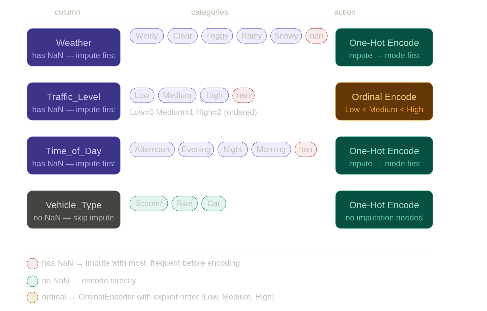
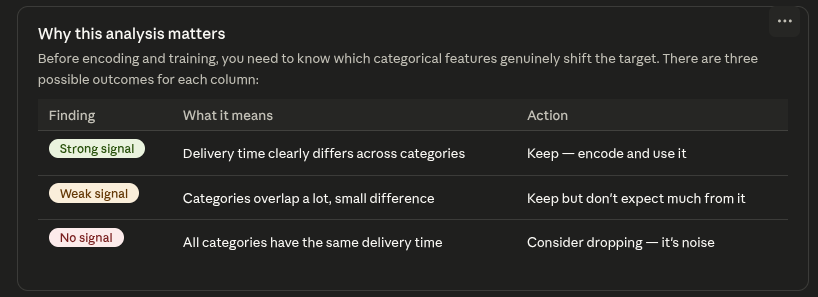
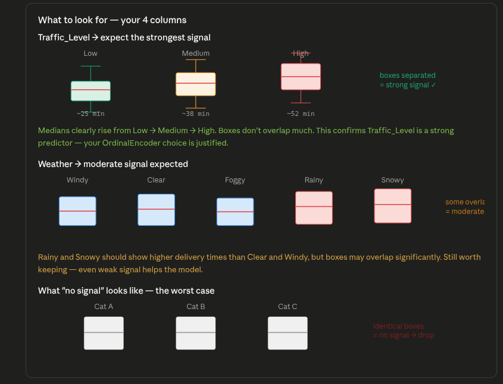
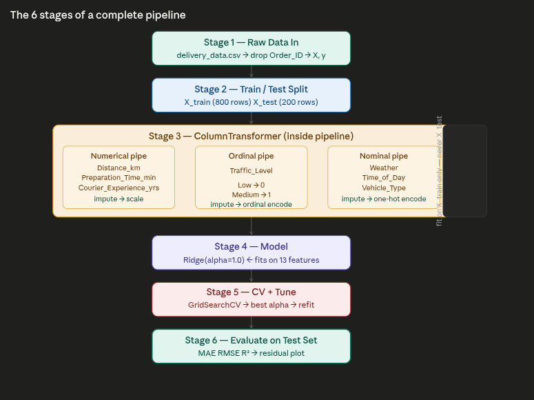

# delivery-time-prediction

---

This happens **after** loading the data and **before** any preprocessing or training. The goal is to answer: *does this category actually affect delivery time, or is it noise?*

------

